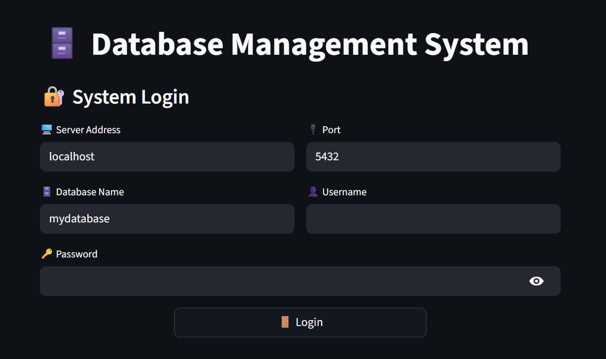
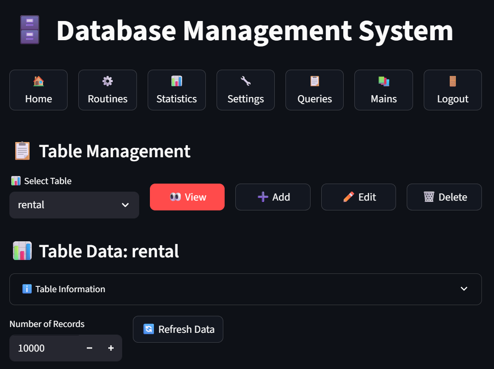
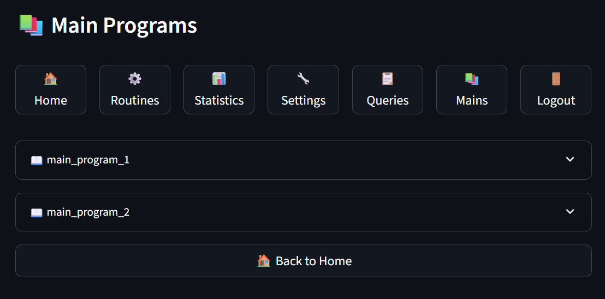
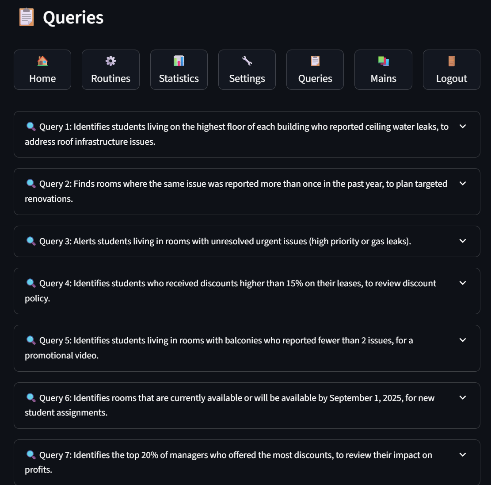
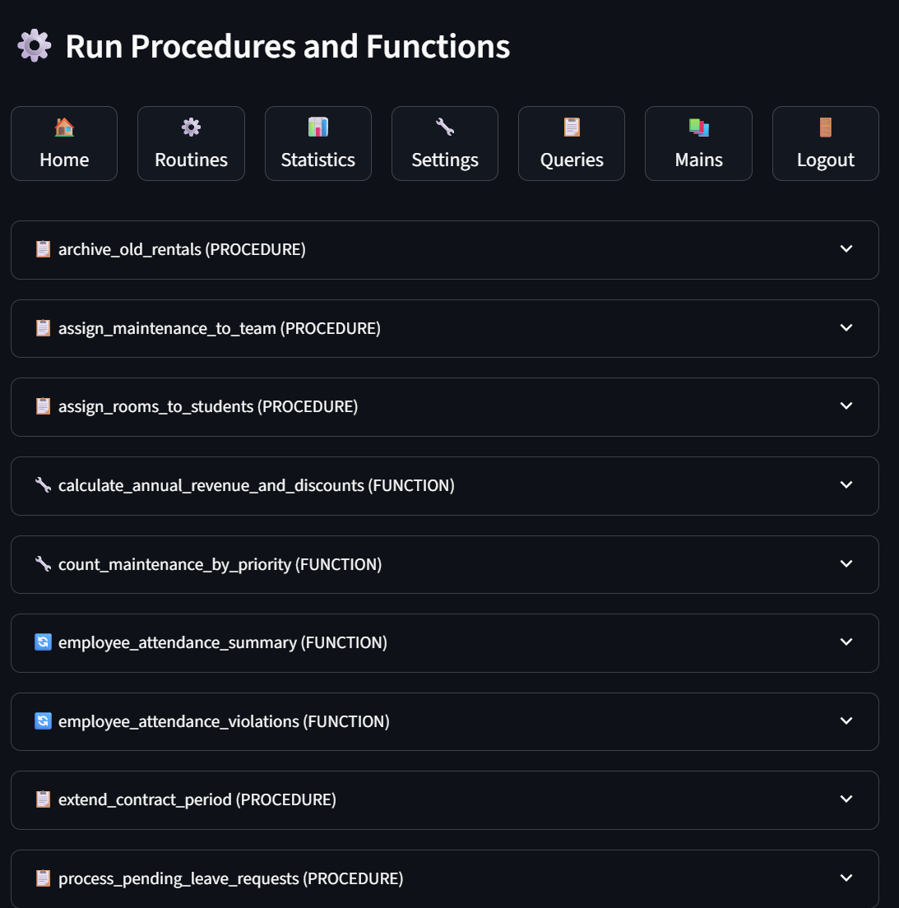

# Phase 5 Submission for DB5785_1228_2532

This repository contains the deliverables for Phase 5 of the Database Project (DB5785_1228_2532). The project provides a Streamlit web-based GUI for interacting with a PostgreSQL database, allowing users to query tables, execute stored procedures and functions (including REF CURSORs), and manage database operations through a the interface.

 
## Running the Application

  

Follow these steps to run and use the Streamlit application, with screenshots in the `Phase5/images/` directory for reference.

  

### Prerequisites

- Ensure **Docker** is installed and running on your system.

- Ensure **Python 3.2+** and **Streamlit** are installed, along with dependencies (`sqlalchemy`, `pandas`, `numpy`, `psycopg2-binary`).

  

### Instructions

1.  **Verify PostgreSQL in Docker**:

- Confirm that a PostgreSQL database is running in a Docker container and listening on port 5432.

- Example command to start PostgreSQL in Docker:

```bash

docker run -d -p 5432:5432 --name postgres -e POSTGRES_PASSWORD=your_password  postgres

```

- Check if PostgreSQL is running:

```bash

docker ps

```

- Ensure your database is configured with the necessary tables, stored procedures, and functions.

  

2.  **Run the Application**:

- Navigate to the `Phase5` directory:

```bash

cd DB5785_1228_2532/Phase5

```

- Launch the Streamlit app:

```bash

streamlit run app.py

```

- Open your browser and go to `http://localhost:8501`.

  

3.  **Navigate the Application**:

-  **Login Screen** (`images/login.png`):

- Enter your PostgreSQL credentials (username, password, host, port, database name).

- Click the **Connect** button to access the database.

-  **Main Menu** (`images/main menu.png`):

- Click buttons in the sidebar to navigate to **Queries**, **Functions & Procedures**, or **Main Programs**.

-  **Queries Interface** (`images/queries.png`):

- Click the **Select Table** menu to choose a table and view its data.

- Use buttons to **Insert**, **Update**, or **Delete** records.

-  **Functions and Procedures Interface** (`images/func and procedures.png`):

- Click the **List Functions/Procedures** button to view available routines.
- Routines are collected and displayed from the project's Docker volume.

- Select a routine, enter parameters, and click **Run** to execute. REF CURSOR results are displayed as tables.

-  **Main Programs Interface** (`images/main programs.png`):

- Click buttons like **Run** to perform predefined actions, with results shown in the interface.

  

### Tips

- If the connection fails, verify PostgreSQL is running on port 5432 and your credentials are correct.

- For REF CURSOR functions, results are fetched automatically and displayed as tables after clicking **Run**.

- Check the terminal for logs if you encounter issues.

  

## Development Process and Tools

  

### Development Process

The application was developed iteratively to create a seamless, button-driven interface for database interactions:

1.  **Database Setup**:

- Designed a PostgreSQL schema with tables, stored procedures, and functions, including REF CURSOR functions for dynamic queries.

- Tested schema and routines using pgAdmin to ensure functionality.

2.  **Backend Development**:

- Built `database_manager.py` to manage database connections, CRUD operations, and routine execution.

- Implemented REF CURSOR support using psycopg2 for cursor fetching and NOTICE capture, with SQLAlchemy for table operations.

- Used pandas to format query results as DataFrames for Streamlit display.

3.  **Frontend Development**:

- Created a Streamlit interface in `ui_components.py`, using buttons for navigation and actions (e.g., Connect, Run, Execute Query).

- Integrated the frontend with the backend in `app.py`, mapping button clicks to database calls.

4.  **Utilities and Models**:

- Developed `utils.py` for input validation, error handling, and data formatting.

- Defined `models.py` for ORM data models, representing the database schema.

5.  **Containerization**:

- Packaged the application in a Docker container for portability, including Python, Streamlit, and dependencies.

- Tested Docker deployment to ensure the app runs consistently across environments.

6.  **Testing and Documentation**:

- Tested key scenarios: table queries, REF CURSOR function execution, and error handling.
- Captured screenshots to document the button-based interface.
  

### Tools Used

-  **Python**: Core language for backend logic, data processing, and Streamlit integration.

-  **SQLAlchemy**: Handled ORM-based table operations in `database_manager.py`.

-  **psycopg2**: Enabled REF CURSOR handling and NOTICE capture for PostgreSQL.

-  **pandas**: Processed query results into DataFrames for Streamlit tables.

-  **Streamlit**: Built the web-based GUI with button-driven navigation, enabling quick creation of interactive interfaces.

-  **PostgreSQL**: Managed data storage and execution of stored procedures/functions.

- Used pgAdmin for schema design and testing.

- Supported REF CURSORs for dynamic result sets.

-  **Docker**: Containerized the application and PostgreSQL for consistent deployment.

- A Dockerfile packages the app, and a PostgreSQL container runs on port 5432.

-  **Streamlit**: Provided a simple, button-based web interface for user interactions.

- Buttons were used for all actions (e.g., Connect, Run, Execute Query) to ensure intuitive navigation.

-  **Git**: Managed version control and submission via tags.
  

### REF CURSOR Implementation

The `database_manager.py` file handles REF CURSOR functions, which are complex due to:

-  **Dynamic Cursor Handling**: Requires fetching results from a cursor name returned by the function, within a transaction.

-  **psycopg2 Usage**: Uses psycopg2 for direct PostgreSQL access to manage cursors and capture NOTICE messages.

-  **Streamlit Integration**: Button clicks (e.g., **Run**) trigger REF CURSOR execution, with results displayed as tables.

-  **Automation**: The `_detect_refcursor_return` method identifies REF CURSOR functions, simplifying user interaction.

  

## Screenshots

  
The following screenshots show the button-based interface:

-  **Login Screen**: Click **Connect** to access the database.



-  **Main Menu**: Click sidebar buttons to navigate.



-  **Main Programs Interface**: Click buttons to run workflows.



-  **Queries Interface**: Click **Run Query** to view data.



-  **Functions and Procedures Interface**: Click **Run** to execute routines.


