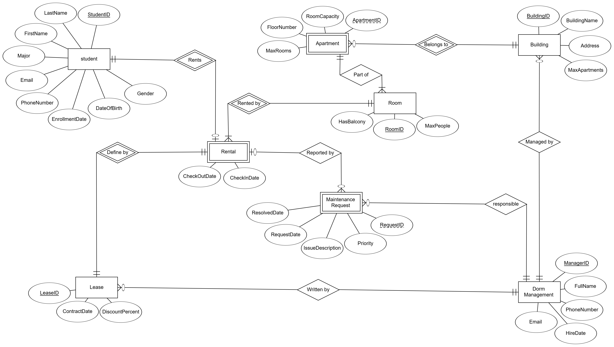
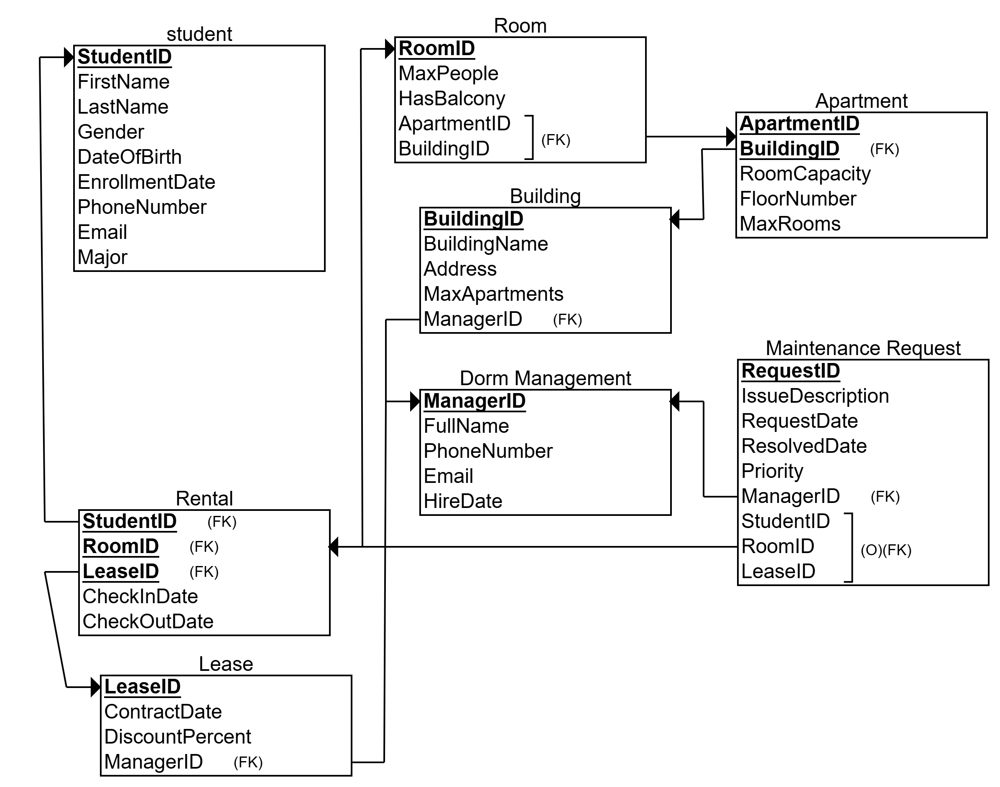
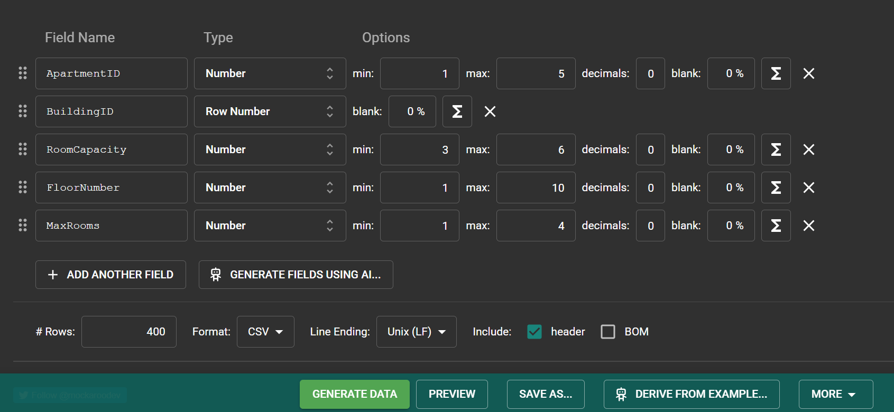

## Project Report: University Management System – Dormitory Management Unit

### Submitted By:
- **Yair Elhasid**
- **Elad Solomon**

---

## Table of Contents
1. [Introduction](#introduction)
2. [ERD and DSD Diagrams](#erd-and-dsd-diagrams)
3. [Design Decisions](#design-decisions)
4. [Data Insertion Methods](#data-insertion-methods)
   - [Method 1: Data Generation with Mockaroo](#method-1-data-generation-with-mockaroo)
   - [Method 2: SQL INSERT Generation with Python](#method-2-sql-insert-generation-with-python)
   - [Method 3: CSV Generation with Python](#method-3-csv-generation-with-python)
5. [Backup and Restore](#backup-and-restore)

---

## Phase 1: Database Design and Construction

### Introduction
The University Management System is designed to manage all activities related to the university, including students, academic and administrative staff, buildings, maintenance, and more. The unit we chose to focus on is dormitory management, which includes registering students to dormitories, managing lease agreements, maintaining dormitory buildings, and managing the staff responsible for them.

The system's data includes student details, dormitory managers, residential buildings, apartments, rooms, lease agreements, active rentals, and maintenance requests. The main functionality enables tracking room assignments for students, managing lease agreements, and efficiently handling maintenance requests. The goal is to create a flexible system that supports the university's changing needs while maintaining data integrity and accuracy.

**Related Files:**
- [View `createTables.sql`](createTables.sql)
- [View `dropTables.sql`](dropTables.sql)
- [View `selectAll.sql`](selectAll.sql)
- [View `insertTables.sql`](insertTables.sql)

---

## ERD and DSD Diagrams

### ERD Description
The ERD diagram describes the relationships between entities in the system:
- **Student**: Personal details (StudentID, FirstName, LastName, gender, date of birth, enrollment date, contact details [PhoneNumber & Email], field of study).
- **Dormitory Management**: Manager details (ManagerID, full name, contact details  [PhoneNumber & Email], employment start date).
- **Building**: Dormitory building details (BuildingID, name, address, maximum number of apartments, responsible manager).
- **Apartment**: Apartment details within buildings (ApartmentID, buildingID, address, room capacity, floor, maximum number of rooms).
- **Room**: Room details (RoomID, maximum capacity of people, presence of a balcony, apartment and building ID).
- **Lease Agreement**: Agreement management (ID number, contract date, discount percentage, manager who executed the agreement).
- **Rental**: Linking students to rooms (student number, room number, agreement number, check-in and check-out dates).
- **Maintenance Request**: Managing maintenance requests (RequestID, description, request and resolution dates, priority, link to relevant entities if necessary).

### Database Tables and Relationships

Below is a detailed breakdown of all tables in the database, their attributes, and the relationships between them as defined in the ERD diagram. The relationships are described in terms of cardinality (e.g., one-to-one, one-to-many, many-to-many) and how they are implemented in the database (e.g., through foreign keys).

#### Tables and Attributes
1. **Student**
   - **Attributes**: `StudentID` (Primary Key), `FirstName`, `LastName`, `Gender`, `DateOfBirth`, `EnrollDate`, `PhoneNumber`, `Email`, `Major`
   - **Description**: Stores personal and academic details of students.

2. **Dorm Management**
   - **Attributes**: `ManagerID` (Primary Key), `FullName`, `PhoneNumber`, `Email`, `HireDate`
   - **Description**: Stores details of dormitory managers.

3. **Building**
   - **Attributes**: `BuildingID` (Primary Key), `BuildingName`, `Address`, `MaxApartments`, `ManagerID` (Foreign Key)
   - **Description**: Stores details of dormitory buildings, including the manager responsible for each building.

4. **Apartment**
   - **Attributes**: `ApartmentID` (Primary Key), `BuildingID` (Foreign Key), `RoomCapacity`, `FloorNumber`, `MaxRooms`
   - **Description**: Stores details of apartments within buildings.

5. **Room**
   - **Attributes**: `RoomID` (Primary Key), `MaxPeople`, `HasBalcony`, `ApartmentID` (Foreign Key), `BuildingID` (Foreign Key, optional)
   - **Description**: Stores details of rooms within apartments, including capacity and balcony presence.

6. **Lease**
   - **Attributes**: `LeaseID` (Primary Key), `ContractDate`, `DiscountPercent`, `ManagerID` (Foreign Key)
   - **Description**: Stores details of lease agreements, including the manager who executed the agreement.

7. **Rental**
   - **Attributes**: `StudentID` (Foreign Key), `RoomID` (Foreign Key), `LeaseID` (Foreign Key), `CheckInDate`, `CheckOutDate`
   - **Description**: Tracks active rentals, linking students to rooms and lease agreements.

8. **Maintenance Request**
   - **Attributes**: `RequestID` (Primary Key), `IssueDescription`, `RequestDate`, `ResolvedDate`, `Priority`, `ManagerID` (Foreign Key), `StudentID` (Foreign Key, optional), `RoomID` (Foreign Key, optional), `LeaseID` (Foreign Key, optional)
   - **Description**: Manages maintenance requests, including optional links to students, rooms, or leases.

#### Relationships and Database Implementation
The relationships between entities are derived from the ERD diagram and implemented in the database using foreign keys. Below is a detailed description of each relationship, its cardinality, and how it is enforced in the database.

1. **Student to Rental (Rents)**
   - **Cardinality**: One-to-Many (optional)
   - **Description**: A student can have zero or many rental records, but each rental is associated with exactly one student.
   - **Implementation**: The `Rental` table includes `StudentID` as a foreign key referencing `Student(StudentID)`. The relationship is optional for the student, meaning a student may not have any rentals.

2. **Student to Maintenance Request (Reported by)**
   - **Cardinality**: One-to-Many (optional)
   - **Description**: A student can report zero or many maintenance requests, but each maintenance request is reported by at most one student (optional).
   - **Implementation**: The `Maintenance Request` table includes `StudentID` as an optional foreign key referencing `Student(StudentID)`. This allows maintenance requests to be reported by a student or anonymously (e.g., for common areas).

3. **Dorm Management to Building (Managed by)**
   - **Cardinality**: One-to-Many
   - **Description**: A manager can manage one or many buildings, but each building is managed by exactly one manager.
   - **Implementation**: The `Building` table includes `ManagerID` as a foreign key referencing `Dorm Management(ManagerID)`.

4. **Dorm Management to Lease (Written by)**
   - **Cardinality**: One-to-Many
   - **Description**: A manager can write one or many lease agreements, but each lease is written by exactly one manager.
   - **Implementation**: The `Lease` table includes `ManagerID` as a foreign key referencing `Dorm Management(ManagerID)`.

5. **Dorm Management to Maintenance Request (Responsible by)**
   - **Cardinality**: One-to-Many
   - **Description**: A manager can be responsible for one or many maintenance requests, but each maintenance request is handled by exactly one manager.
   - **Implementation**: The `Maintenance Request` table includes `ManagerID` as a foreign key referencing `Dorm Management(ManagerID)`.

6. **Building to Apartment (Belongs to)**
   - **Cardinality**: One-to-Many
   - **Description**: A building can have one or many apartments, but each apartment belongs to exactly one building.
   - **Implementation**: The `Apartment` table includes `BuildingID` as a foreign key referencing `Building(BuildingID)`.

7. **Apartment to Room (Part of)**
   - **Cardinality**: One-to-Many
   - **Description**: An apartment can have one or many rooms, but each room is part of exactly one apartment.
   - **Implementation**: The `Room` table includes `ApartmentID` as a foreign key referencing `Apartment(ApartmentID)`.

8. **Room to Rental (Rented by)**
   - **Cardinality**: One-to-Many
   - **Description**: A room can be rented by one or many students (through rental records), but each rental is associated with exactly one room.
   - **Implementation**: The `Rental` table includes `RoomID` as a foreign key referencing `Room(RoomID)`.

9. **Room to Maintenance Request (Reported by)**
   - **Cardinality**: One-to-Many (optional)
   - **Description**: A room can have zero or many maintenance requests associated with it, but each maintenance request is linked to at most one room (optional).
   - **Implementation**: The `Maintenance Request` table includes `RoomID` as an optional foreign key referencing `Room(RoomID)`.

10. **Lease to Rental (Defined by)**
    - **Cardinality**: One-to-Many
    - **Description**: A lease can be associated with one or many rentals, but each rental is defined by exactly one lease.
    - **Implementation**: The `Rental` table includes `LeaseID` as a foreign key referencing `Lease(LeaseID)`.

11. **Lease to Maintenance Request (Reported by)**
    - **Cardinality**: One-to-Many (optional)
    - **Description**: A lease can have zero or many maintenance requests associated with it, but each maintenance request is linked to at most one lease (optional).
    - **Implementation**: The `Maintenance Request` table includes `LeaseID` as an optional foreign key referencing `Lease(LeaseID)`.

### DSD Description
The DSD diagram details the structure of the tables, including columns, data types, and keys (primary and foreign), ensuring data consistency according to the ERD.

---

## Design Decisions

During the system design, several key design decisions were made:
1. **Students Without Dormitory Rentals**: We created 700 students – more than the requirement (400) to demonstrate that some students do not rent a dormitory apartment. Since there is a reality where students may live outside the dormitories, we defined the relationship between a student and a rental as optional.
2. **Flexibility in Maintenance Requests**: Maintenance requests are not required to be associated with a specific student, room, or lease agreement, to allow reporting of issues in common areas or unoccupied rooms.
3. **Building and Room Capacity Limits**: Each room includes a `MaxPeople` attribute, and rentals respect this limit, allowing multiple students per room but not illogical or illegal assignments. Similarly, restrictions and checks were set for the maximum number of rooms per apartment and the maximum number of apartments per building. These decisions aim to ensure flexibility, alignment with reality, and data integrity.
4. **Maintenance Requests as Needed**: There is no limit on the number of maintenance requests that can be opened, based on realistic considerations. Additionally, there is no obligation to open a maintenance request – only when there is a need.
A student who rents an apartment in a dormitory is not required to submit a maintenance request at any point during their stay, but they may do so if needed.

---

## Data Insertion Methods

We implemented three methods for inserting data into the database, each supporting the creation of consistent data.

### Method 1: Data Generation with Mockaroo
The Mockaroo service was used to generate random data for the apartments table, which was then loaded into the database.

  
  
  
[View `MOCK_DATA.csv`](mockarooFiles/MOCK_DATA.csv)

### Method 2: SQL INSERT Generation with Python
Using a Python script, we created `INSERT INTO` commands for all tables, which were written to `.sql` files. This method allows us full control over the relationships between the data. With Python, we can generate data that relies on relationships between tables and logical constraints we established during the database design. In implementing the Python script, we built functions to create mock data and also utilized a library for generating mock data in Python.

  
  
[View `data_generator.py`](Programing/data_generator.py)  
[View `student.sql`](Programing/sql%20[insert]%20files/student.sql)  
[View `dorm_management.sql`](Programing/sql%20[insert]%20files/dorm_management.sql)  
[View `building.sql`](Programing/sql%20[insert]%20files/building.sql)  
[View `apartment.sql`](Programing/sql%20[insert]%20files/apartment.sql)  
[View `room.sql`](Programing/sql%20[insert]%20files/room.sql)  
[View `lease.sql`](Programing/sql%20[insert]%20files/lease.sql)  
[View `rental.sql`](Programing/sql%20[insert]%20files/rental.sql)  
[View `maintenance_request.sql`](Programing/sql%20[insert]%20files/maintenance_request.sql)  

### Method 3: CSV Generation with Python
The same Python script also created `.csv` files with data identical to that generated via SQL INSERT commands. This method allows importing data into the database and loading it into the tables.

  
  
[View `data_generator.py`](Programing/data_generator.py)  
[View `student.csv`](Programing/csv%20files/student.csv)  
[View `dorm_management.csv`](Programing/csv%20files/dorm_management.csv)  
[View `building.csv`](Programing/csv%20files/building.csv)  
[View `apartment.csv`](Programing/csv%20files/apartment.csv)  
[View `room.csv`](Programing/csv%20files/room.csv)  
[View `lease.csv`](Programing/csv%20files/lease.csv)  
[View `rental.csv`](Programing/csv%20files/rental.csv)  
[View `maintenance_request.csv`](Programing/csv%20files/maintenance_request.csv)

---

## Backup and Restore

### Backup Process
We performed a full backup of the database using pgAdmin. The backup includes the table structure and all data in the database.

  
  
[View Backup File](Backups/backup_28_03_2025)

### Restore Process
We restored the backup to a new database to verify data integrity. The process successfully restored all tables and the data we created within them.

  

---
