# Phase 2 Project Report - Dormitory Management System

## Table of Contents
- [Introduction](#introduction)
- [SELECT Queries](#select-queries)
  - [Query 1: Students on Top Floors with Ceiling Leaks](#query-1-students-on-top-floors-with-ceiling-leaks)
  - [Query 2: Rooms with the Same Issue Reported Multiple Times](#query-2-rooms-with-the-same-issue-reported-multiple-times)
  - [Query 3: Students with Urgent Unfixed Issues](#query-3-students-with-urgent-unfixed-issues)
  - [Query 4: Students with Big Lease Discounts](#query-4-students-with-big-lease-discounts)
  - [Query 5: Students in Balcony Rooms with Few Issues](#query-5-students-in-balcony-rooms-with-few-issues)
  - [Query 6: Rooms Available by September 1, 2025](#query-6-rooms-available-by-september-1-2025)
  - [Query 7: Top 20% Managers Giving Discounts](#query-7-top-20-managers-giving-discounts)
  - [Query 8: Buildings with More Problems in Winter than in Summer](#query-8-buildings-with-more-problems-in-winter-than-in-summer)
- [UPDATE Queries](#update-queries)
  - [Update Query 1: Give More Discount to Students with No Issues](#update-query-1-give-more-discount-to-students-with-no-issues)
  - [Update Query 2: Add More Space in Empty Apartments](#update-query-2-add-more-space-in-empty-apartments)
  - [Update Query 3: Add Balconies to Top Rooms in Jerusalem](#update-query-3-add-balconies-to-top-rooms-in-jerusalem)
- [DELETE Queries](#delete-queries)
  - [Deletion Query 1: Remove Student with Too Many Requests](#deletion-query-1-remove-student-with-too-many-requests)
  - [Deletion Query 2: Remove Inactive Managers](#deletion-query-2-remove-inactive-managers)
  - [Deletion Query 3: Remove Empty Apartments and Buildings](#deletion-query-3-remove-empty-apartments-and-buildings)
- [Constraints](#constraints)
  - [Constraint 1: Check on DiscountPercent in Lease Table](#constraint-1-check-on-discountpercent-in-lease-table)
  - [Constraint 2: NOT NULL and CHECK on PhoneNumber in Student Table](#constraint-2-not-null-and-check-on-phonenumber-in-student-table)
  - [Constraint 3: NOT NULL and CHECK on CheckOutDate in Rental Table](#constraint-3-not-null-and-check-on-checkoutdate-in-rental-table)
- [Transaction Management (Rollback and Commit)](#transaction-management-rollback-and-commit)
  - [Update with ROLLBACK](#update-with-rollback)
  - [Update with COMMIT](#update-with-commit)
- [Final SQL Files](#final-sql-files)

---

## Introduction
A new manager, David, recently took over the university dormitory system, and he quickly noticed that things were a bit of a mess. The database was full of outdated records, some students were causing headaches with endless maintenance requests, and there were even empty apartments and buildings that no one had bothered to clean up. On top of that, different departments kept coming to him with urgent requests: the maintenance team needed to know which buildings had the most issues, the finance team wanted to check on lease discounts, and the marketing team was asking for data to make a promotional video. David knew he had to get the database in order and provide the information everyone needed.

To start, David made sure to back up the database before making any changes. On April 23, 2025, he created a backup called `backup23_04_2025` after adding more data to the system, preparing it for the complex tasks ahead. Then, he and his team got to work: they wrote queries to find specific information, updated records to improve the dorms, removed outdated or problematic entries, and added rules to prevent future errors. After finishing all the changes, David created a final backup on April 24, 2025, named `Backup__2__24_04_2025`, so they could always go back to the updated database if needed.

This report shows everything David’s team did in Phase 2: the queries they ran to find information, the updates and deletions they made to fix the database, the rules they added to keep things in check, and how they tested changes to make sure everything worked smoothly.

All SQL scripts for this phase can be found here:  
[**Queries.sql**](./Queries.sql) | [**UpdateAndDelete.sql**](./UpdateAndDelete.sql) | [**Constraints.sql**](./Constraints.sql) | [**RollbackCommit.sql**](./RollbackCommit.sql)

---

## SELECT Queries

### Query 1: Students on Top Floors with Ceiling Leaks
**Story**: The maintenance department is planning to fix roof leaks in several buildings after heavy rain caused problems. They needed to identify students living on the top floors who reported ceiling leaks, so they can notify them about the upcoming repairs and minimize disruptions.

This query identifies students living on the highest floor of each building who reported ceiling water leaks, helping to address roof infrastructure issues by pinpointing potential problem areas.

- **Execution and Result**:  
  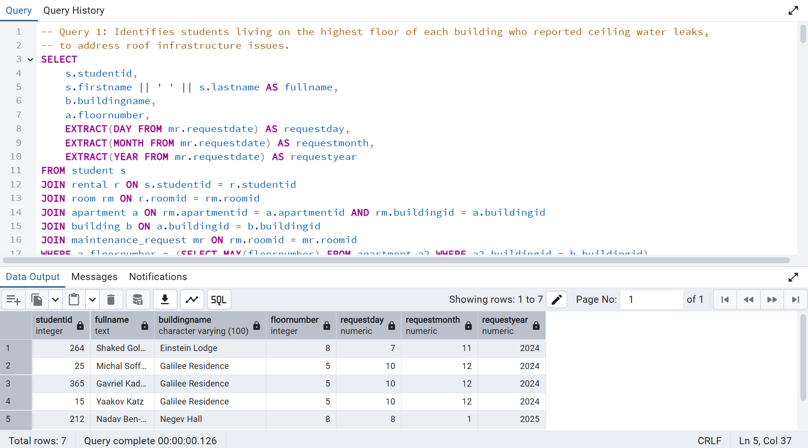

### Query 2: Rooms with the Same Issue Reported Multiple Times
**Story**: The university is planning a major renovation project to improve living conditions in the dormitories. To allocate resources efficiently, the facilities team decided to focus on rooms where the same maintenance issue was reported multiple times in the past year, indicating persistent problems that need targeted fixes.

This query finds rooms where the same maintenance issue was reported more than once in the past year, aiding in planning targeted renovations.

- **Execution and Result**:  
  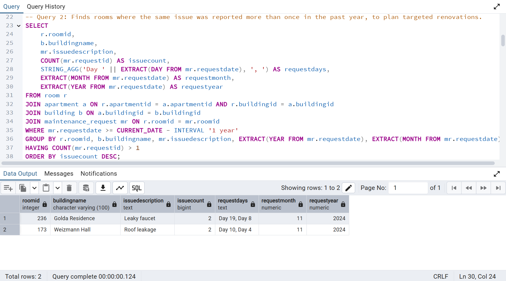

### Query 3: Students with Urgent Unfixed Issues
**Story**: The safety committee received complaints about unresolved maintenance issues, particularly those involving high-priority problems or gas leaks, which pose serious risks to students. They decided to generate a report to alert students living in affected rooms, ensuring these issues are addressed immediately.

This query alerts students living in rooms with unresolved urgent issues (high priority or gas leaks), ensuring timely resolution of critical problems.

- **Execution and Result**:  
  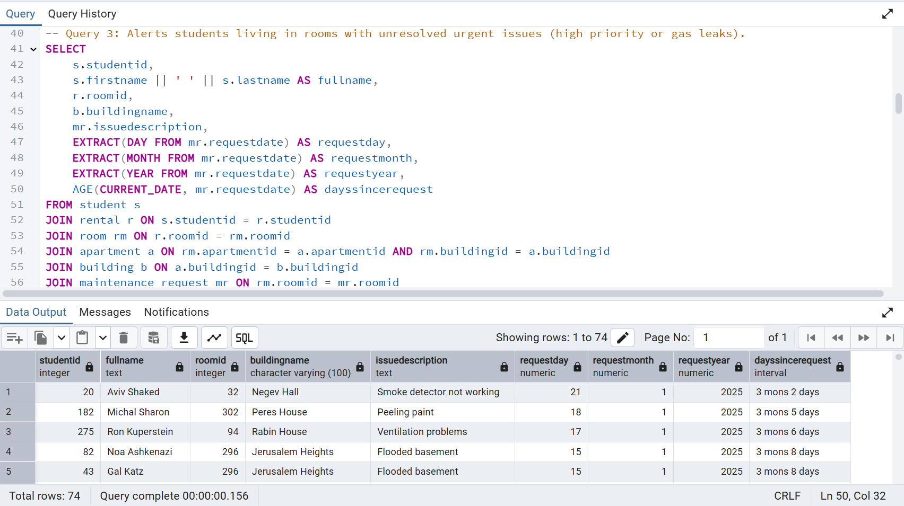

### Query 4: Students with Big Lease Discounts
**Story**: The finance department noticed a significant drop in revenue from lease agreements this semester. To investigate, they decided to review the discount policy by identifying students who received lease discounts higher than 15%, as these may be impacting overall profitability.

This query identifies students who received lease discounts higher than 15%, to review the discount policy and its impact on revenue.

- **Execution and Result**:  
  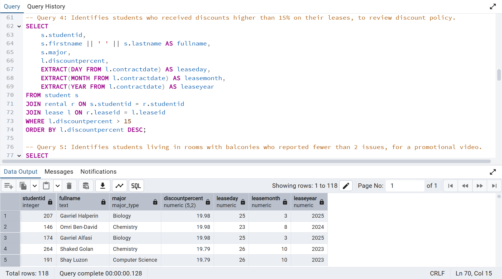

### Query 5: Students in Balcony Rooms with Few Issues
**Story**: The marketing team wants to show happy students living in rooms with balconies to convince new students to pay more for upgraded rooms that include a balcony. They decided to find students with balconies who reported fewer than 2 maintenance issues in the past year, as these students are likely to be satisfied and can share positive experiences.

This query identifies students living in rooms with balconies who reported fewer than 2 maintenance issues in the past year, for inclusion in a promotional video.

- **Execution and Result**:  
  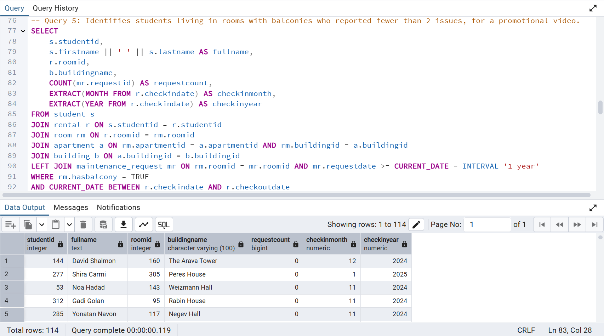

### Query 6: Rooms Available by September 1, 2025
**Story**: With the new academic year approaching, the housing office needs to assign rooms to incoming students. They decided to identify rooms that are currently available or will be available by September 1, 2025, to ensure a smooth assignment process for the new semester.

This query identifies rooms that are currently available or will be available by September 1, 2025, for new student assignments.

- **Execution and Result**:  
  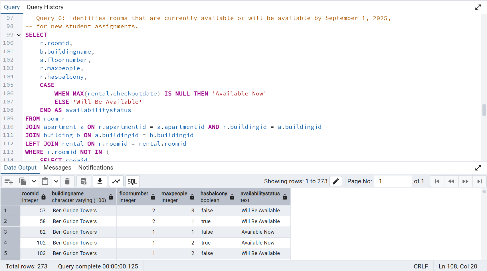

### Query 7: Top 20% Managers Giving Discounts
**Story**: The dormitory administration is concerned that some managers may be offering too many discounts, affecting the overall budget. To evaluate their performance, they decided to identify the top 20% of managers who offered the most discounts, to review their impact on profits and adjust policies if needed.

This query identifies the top 20% of managers who offered the most discounts, to review their impact on profits.

- **Execution and Result**:  
  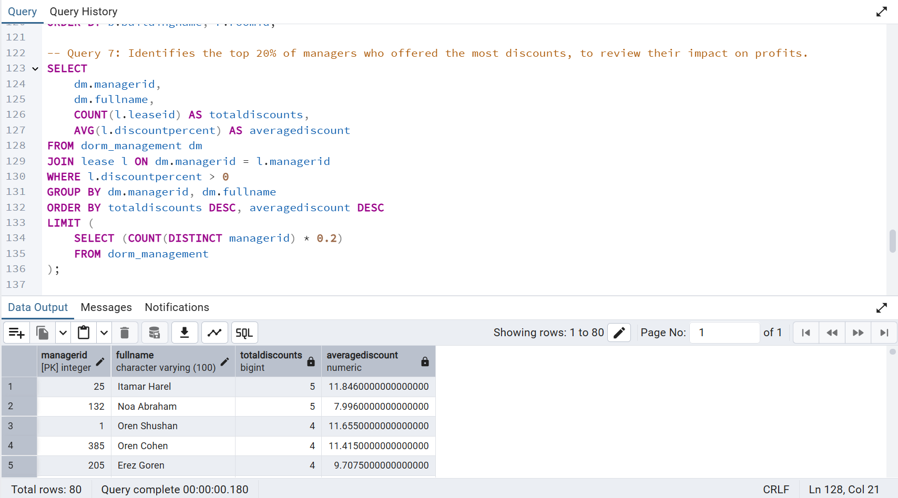

### Query 8: Buildings with More Problems in Winter than in Summer
**Story**: As winter approaches, the maintenance team wants to prepare for potential issues caused by cold weather. They decided to analyze past data to identify buildings with more maintenance issues reported in winter (Dec-Feb) than in summer (Jun-Aug), to prioritize preventive maintenance in those buildings.

This query identifies buildings with more maintenance issues reported in winter (Dec-Feb) than in summer (Jun-Aug), to prepare for the cold season.

- **Execution and Result**:  
  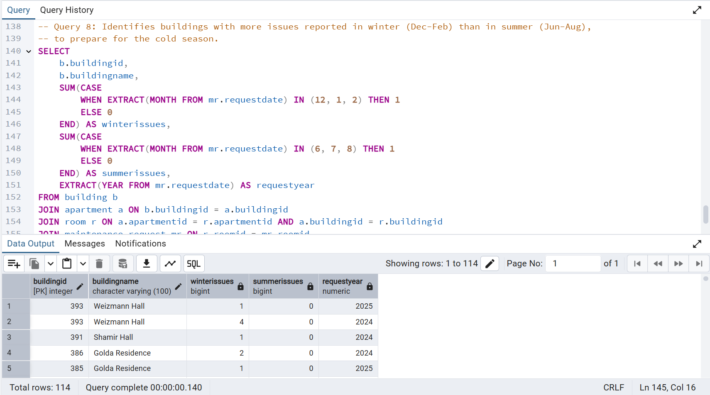

---

## UPDATE Queries

### Update Query 1: Give More Discount to Students with No Issues
**Story**: The dormitory administration wants to reward students who maintain their rooms well by offering them a small incentive. They decided to increase the lease discount by 3% for students who have not submitted any maintenance requests, ensuring the discount does not exceed 15%, to encourage responsible tenancy.

This query increases the discount by 3% for students renting an apartment with no maintenance requests, ensuring the discount does not exceed 15%.

- **Execution**:  
  
- **Before Update**:  
  
- **After Update**:  
  

### Update Query 2: Add More Space in Empty Apartments
**Story**: Following a recent renovation project, the university decided to increase the capacity of rooms in completely vacant apartments to accommodate more students next semester. They chose to increase the maximum number of occupants by 1 in these rooms, optimizing space usage in the dormitories.

This query increases the maximum number of occupants by 1 in rooms of completely vacant apartments, following a renovation.

- **Execution**:  
  
- **Before Update**:  
  
- **After Update**:  
  

### Update Query 3: Add Balconies to Top Rooms in Jerusalem
**Story**: The city of Jerusalem issued a renovation permit allowing the addition of balconies to top-floor rooms in university buildings, aiming to improve student living conditions. The dormitory administration decided to implement this upgrade by adding balconies to eligible rooms in Jerusalem buildings.

This query adds balconies to rooms on the top floors of buildings in Jerusalem, following a city-wide renovation permit.

- **Execution**:  
  
- **Before Update**:  
  
- **After Update (False Values)**:  
  %20Update%20Query%203.png)  
  *When we search for rooms with `HasBalcony = FALSE`, we see no results. This is because the update added balconies to all top-floor rooms in Jerusalem buildings, so there are no longer any top-floor rooms in these buildings without balconies.*

- **After Update (True Values)**:  
  %20Update%20Query%203.png)  
  *When we search for rooms with `HasBalcony = TRUE`, we see all the top-floor rooms in Jerusalem buildings that meet the conditions. This confirms that balconies were successfully added to these rooms as part of the update.*

---

## DELETE Queries

### Deletion Query 1: Remove Student with Too Many Requests
**Story**: The dormitory administration identified a student who submitted an unusually high number of maintenance requests (more than 5 in the past year), placing a significant burden on the maintenance team. To address this, they decided to terminate the student's lease, focusing on the student with the highest number of requests.

This query deletes the student who submitted more than 5 maintenance requests in the past year and has the highest number of requests.

- **Execution**:  
  
- **Before Deletion**:  
  
- **After Deletion**:  
  

### Deletion Query 2: Remove Inactive Managers
**Story**: As part of a staff optimization initiative, the university decided to reduce overhead costs by terminating inactive managers who have not handled any maintenance requests or issued leases. To ensure continuity, they decided to temporarily assign Manager 101 to take over responsibility for these buildings.

This query deletes inactive managers who neither handled maintenance requests nor issued leases, as part of staff optimization. It first reassigns their buildings to an interim manager (ManagerID = 101).

- **Step 1: Update Building Table (Execution)**:  
  
- **Before Update (Building Table)**:  
  
- **Before Deletion (Dorm_Management Table)**:  
  
- **Step 2: Delete Inactive Managers (Execution)**:  
  
- **After Deletion (Dorm_Management Table)**:  
  

### Deletion Query 3: Remove Empty Apartments and Buildings
**Story**: During a database cleanup initiative, the IT team discovered that some apartments have no rooms assigned, and some buildings have no apartments, likely due to data entry errors or outdated records. They decided to remove these empty entities to maintain a clean and accurate database.

This query deletes apartments with no rooms and buildings with no apartments, ensuring the database does not contain empty entities.

- **Part 1: Delete Apartments with No Rooms (Execution)**:  
  
- **Before Part 1**:  
  
- **After Part 1**:  
  
- **Part 2: Delete Buildings with No Apartments (Execution)**:  
  
- **Before Part 2**:  
  
- **After Part 2**:  
  

---

## Constraints

### Constraint 1: Check on DiscountPercent in Lease Table
**Story**: The finance team noticed inconsistencies in lease discounts, with some entries exceeding reasonable limits. To prevent future errors, they decided to enforce a constraint ensuring that the `DiscountPercent` in the `Lease` table stays within a valid range (0 to 100).

This constraint ensures that the `DiscountPercent` in the `Lease` table is between 0 and 100.

- **ALTER TABLE Command**:  
  ```sql
  ALTER TABLE Lease
  ADD CONSTRAINT check_discountpercent_range
  CHECK (DiscountPercent >= 0 AND DiscountPercent <= 100);
  ```
- **Violation Test (Setting DiscountPercent to 300)**:  
  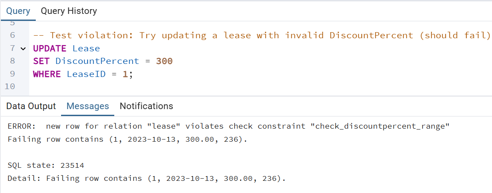

### Constraint 2: NOT NULL and CHECK on PhoneNumber in Student Table
**Story**: The administration office found that some student records were missing phone numbers or had incorrect formats, making communication difficult. They decided to enforce a constraint requiring a valid phone number in the format `+972 5X-XXX-XXXX` and ensuring it is never null.

This constraint ensures that the `PhoneNumber` in the `Student` table is not null and follows the format `+972 5X-XXX-XXXX`.

- **ALTER TABLE Commands**:  
  ```sql
  ALTER TABLE Student
  ALTER COLUMN PhoneNumber SET NOT NULL;

  ALTER TABLE Student
  ADD CONSTRAINT check_student_phonenumber
  CHECK (PhoneNumber ~ '^\+972 5[0-9]-[0-9]{3}-[0-9]{4}$');
  ```
- **Violation Test 1 (Invalid PhoneNumber Format)**:  
  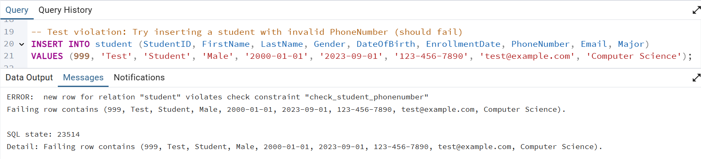
- **Violation Test 2 (NULL PhoneNumber)**:  
  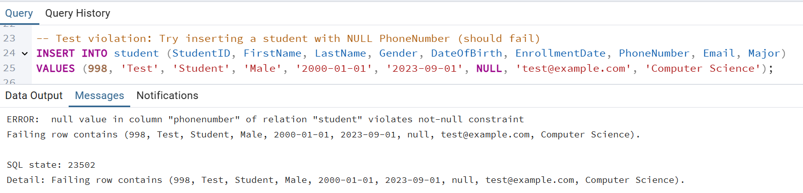

### Constraint 3: NOT NULL and CHECK on CheckOutDate in Rental Table
**Story**: The housing office encountered issues with rental records where the checkout date was missing or earlier than the check-in date, causing scheduling conflicts. They decided to enforce a constraint ensuring that `CheckOutDate` is not null and is always after `CheckInDate`.

This constraint ensures that the `CheckOutDate` in the `Rental` table is not null and is after the `CheckInDate`.

- **ALTER TABLE Commands**:  
  ```sql
  ALTER TABLE Rental
  ALTER COLUMN CheckOutDate SET NOT NULL;

  ALTER TABLE Rental
  ADD CONSTRAINT check_checkout_after_checkin
  CHECK (CheckOutDate > CheckInDate);
  ```
- **Violation Test 1 (CheckOutDate Before CheckInDate)**:  
  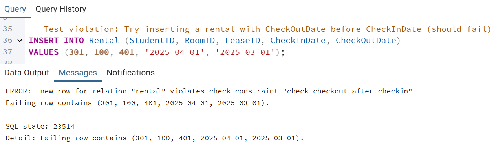
- **Violation Test 2 (NULL CheckOutDate)**:  
  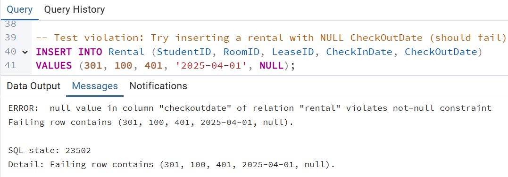

---

## Transaction Management (Rollback and Commit)

This section demonstrates the use of transactions to manage updates in the database, ensuring data integrity through rollback and commit operations. Each step is executed and captured to show the state of the database throughout the process.

### Update with ROLLBACK
**Story**: The finance team wanted to test a potential discount increase for a specific lease (LeaseID = 400) by adding 5% to the `DiscountPercent`. However, they were unsure if the change would be appropriate for the budget. They decided to perform the update within a transaction, check the result, and then roll it back to evaluate the impact without making permanent changes.

This demonstrates an update to the `Lease` table with a rollback, showing the database state at each step:

- **Step 1: Initial State (Before Update)**:  
  The initial state of the `Lease` table for LeaseID 400 is shown before any changes are made. The query `SELECT LeaseID, DiscountPercent FROM Lease WHERE LeaseID = 400;` is executed.  
  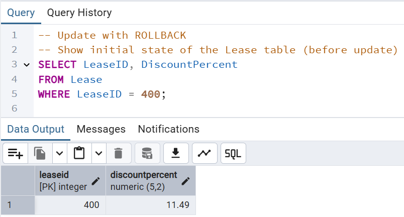

- **Step 2: Start Transaction**:  
  A transaction is started with the `BEGIN;` 
  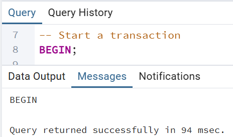

- **Step 3: Update DiscountPercent**:  
  The update is applied with the query `UPDATE Lease SET DiscountPercent = DiscountPercent + 5 WHERE LeaseID = 400;`, increasing the `DiscountPercent` by 5 for LeaseID 400.  
  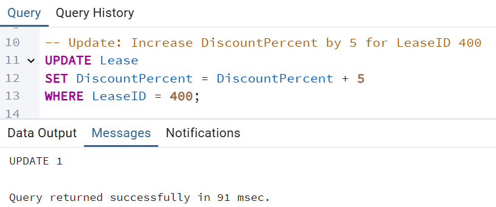

- **Step 4: State After Update (Before Rollback)**:  
  The state of the `Lease` table is checked after the update but before the rollback, using `SELECT LeaseID, DiscountPercent FROM Lease WHERE LeaseID = 400;`. The `DiscountPercent` reflects the temporary increase.  
  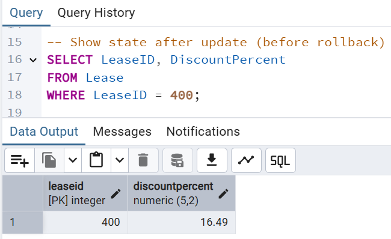

- **Step 5: Rollback the Transaction**:  
  The transaction is rolled back with the `ROLLBACK;` reverting all changes made within the transaction.  
  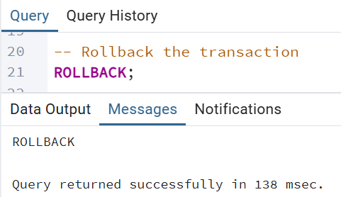

- **Step 6: State After Rollback (Returns to Initial State)**:  
  The final state of the `Lease` table is checked after the rollback, using `SELECT LeaseID, DiscountPercent FROM Lease WHERE LeaseID = 400;`. The `DiscountPercent` has returned to its original value, confirming the rollback was successful.  
  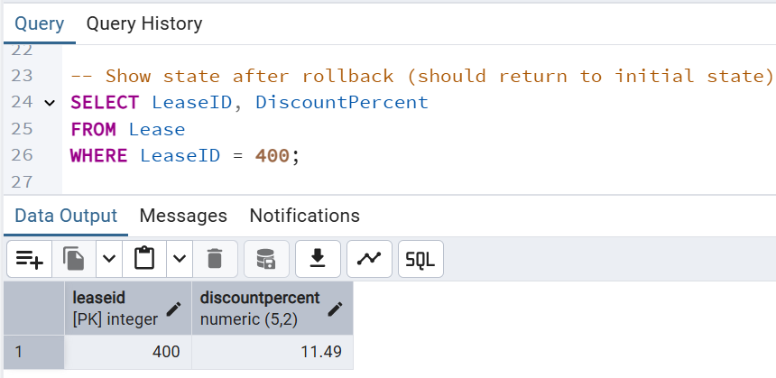

### Update with COMMIT
**Story**: Following a room renovation, the housing office decided to permanently increase the maximum number of occupants for a specific room (RoomID = 400) by 1, changing the `MaxPeople` (also referred to as `MaxOccupants` in the database) from 3 to 4. They performed the update within a transaction and committed it to ensure the change is saved, confirming the update's success. Afterward, they attempted a rollback to verify that the change was indeed permanent.

This demonstrates an update to the `Room` table with a commit, showing the database state at each step:

- **Step 1: Initial State (Before Update)**:  
  The initial state of the `Room` table for RoomID 400 is shown, with `MaxPeople` set to 3 before any changes are made. The query `SELECT RoomID, MaxPeople FROM Room WHERE RoomID = 400;` is executed.  
  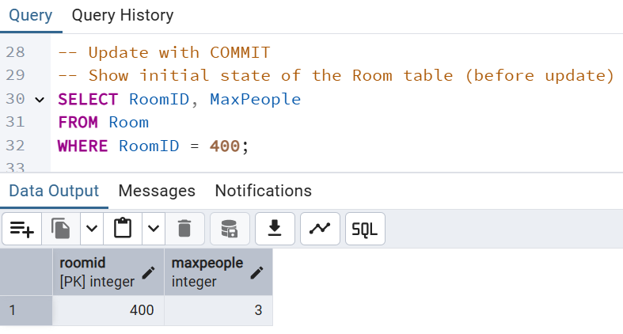

- **Step 2: Start Transaction**:  
  A transaction is started with the `BEGIN;`
  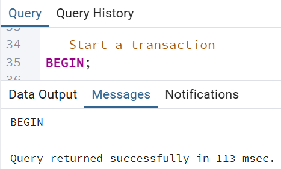

- **Step 3: Update MaxPeople**:  
  The update is applied with the query `UPDATE Room SET MaxPeople = MaxPeople + 1 WHERE RoomID = 400;`, increasing the `MaxPeople` by 1 for RoomID 400 (from 3 to 4).  
  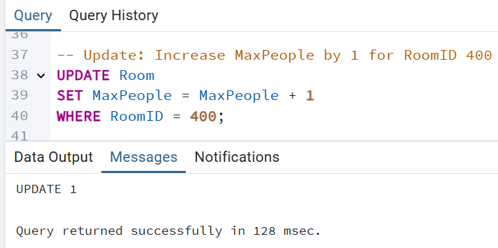

- **Step 4: State After Update (Before Commit)**:  
  The state of the `Room` table is checked after the update but before the commit, using `SELECT RoomID, MaxPeople FROM Room WHERE RoomID = 400;`. The `MaxPeople` reflects the temporary increase to 4.  
  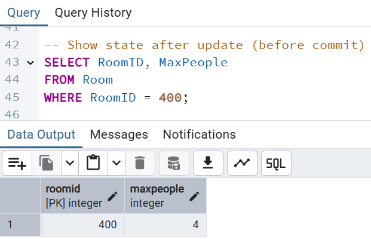

- **Step 5: Commit the Transaction**:  
  The transaction is committed with the `COMMIT;` command, making the update permanent.  
  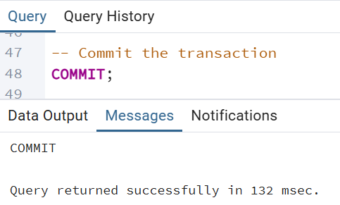

- **Step 6: State After Commit (Change is Permanent)**:  
  The state of the `Room` table is checked after the commit, using `SELECT RoomID, MaxPeople FROM Room WHERE RoomID = 400;`. The `MaxPeople` remains 4, confirming the update was successfully committed.  
  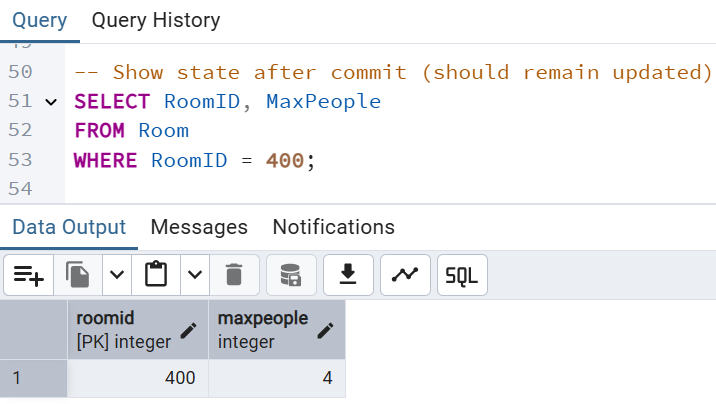

- **Step 7: Attempt to Rollback After Commit (No Effect)**:  
  An attempt to rollback is made with the `ROLLBACK;` command after the commit. Since the transaction was already committed, this action has no effect, and the `MaxPeople` remains 4.  
  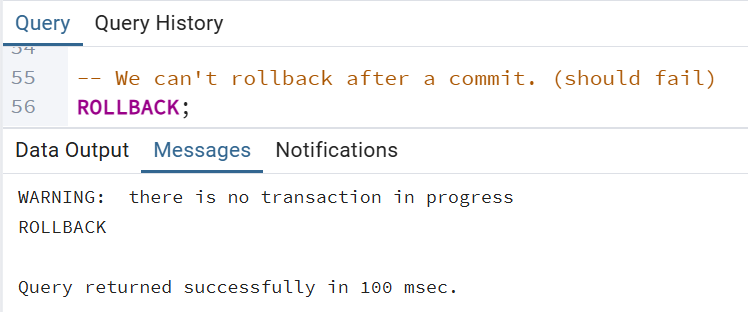

---

## Final SQL Files
The final SQL files for this phase are included in the repository. You can view their contents using the links below:

- [View `Queries.sql`](./Queries.sql)  
- [View `UpdateAndDelete.sql`](./UpdateAndDelete.sql)  
- [View `Constraints.sql`](./Constraints.sql)  
- [View `RollbackCommit.sql`](./RollbackCommit.sql)
