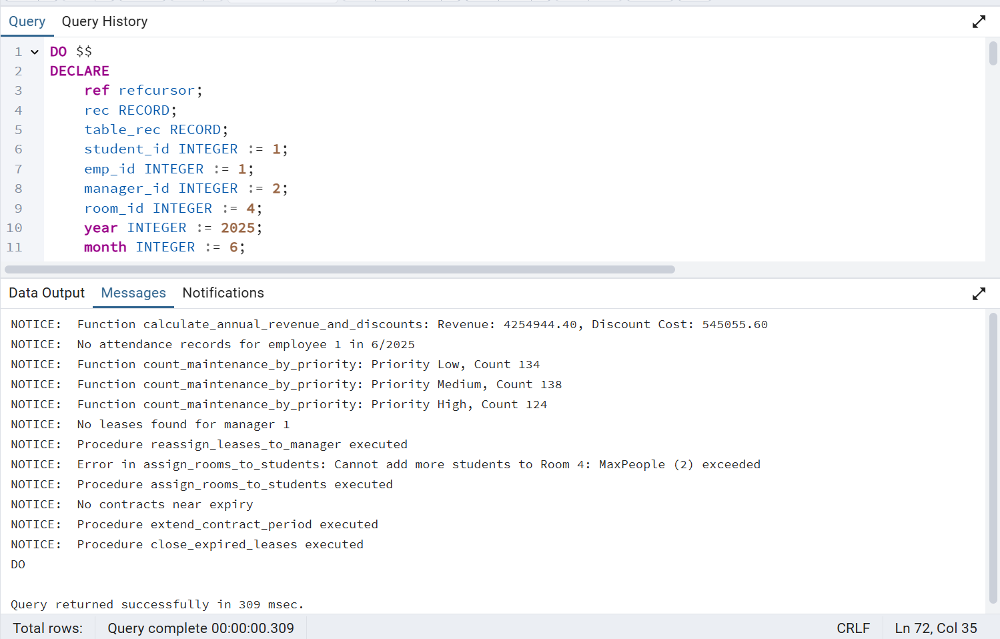
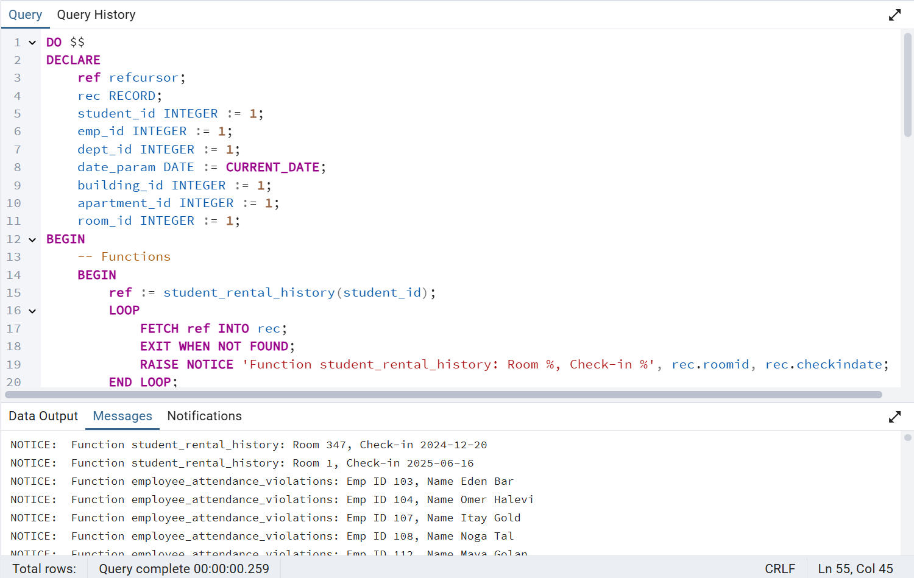
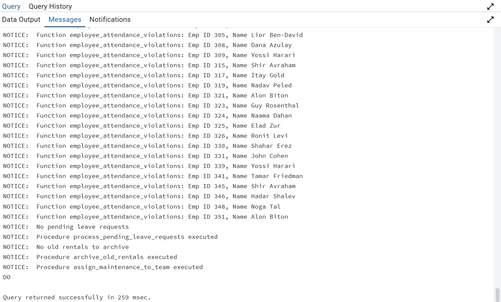

# Stage 4 - PL/pgSQL Main Programs

This README details the implementation and execution of the two main programs (`main_program_1.sql` and `main_program_2.sql`) for the dormitory management system. For each program, we provide a verbal description, the code, execution with screenshots showing outputs and database updates, and a short narrative illustrating its use case and purpose. Additionally, a one-sentence explanation is provided for each trigger, function, and procedure.


## Triggers

-   **log_changes**: Logs INSERT/UPDATE operations on `lease`, `rental`, and `maintenance_request` tables to the `change_log` table for keeping history  - archive purposes.
-   **check_max_apartments**: Prevents inserting apartments into a building if the count exceeds the `MaxApartments` limit defined in the `Building` table.
-   **check_max_rooms**: Ensures the number of rooms in an apartment does not exceed the `MaxRooms` limit specified in the `Apartment` table.
-   **check_max_people**: Blocks rental insertions if the number of students in a room exceeds the `MaxPeople` limit defined in the `Room` table.


## Functions

-   **calculate_annual_revenue_and_discounts**: Calculates total revenue and discount costs for leases in a specified academic year based on a fixed rental cost.
-   **employee_attendance_summary**: Returns a refcursor with attendance details for an employee in a given month and year, updating incomplete records.
-   **count_maintenance_by_priority**: Summarizes maintenance requests by priority to provide workload insights.
-   **employee_attendance_violations**: Identifies employees who failed to log attendance on a specific date via a refcursor.
-   **student_rental_history**: Retrieves a student’s rental history (lease ID, room ID, check-in, and check-out dates) using a refcursor, validating date consistency.


## Procedures

-   **reassign_leases_to_manager**: Updates the `managerid` field in the `lease` table to transfer leases from one manager to another.
-   **assign_rooms_to_students**: Creates a new lease and rental record to assign a room to a student with a randomly selected manager.
-   **extend_contract_period**: Extends the end date of contracts nearing expiration by a specified number of months.
-   **process_pending_leave_requests**: Approves or rejects pending leave requests for managers based on their recent attendance records.
-   **archive_old_rentals**: Moves rental records older than two years to the `rental_archive` table and deletes them from the `rental` table.
-   **assign_maintenance_to_team**: Assigns unresolved maintenance requests to an employee in a specified department.


## Main Program 1

### Description

**Main Program 1** automates financial and administrative tasks in the dormitory management system. It calls three functions and three procedures:

-   **Functions**:
    -   `calculate_annual_revenue_and_discounts`: Computes revenue and discount costs for the 2025 academic year.
    -   `employee_attendance_summary`: Retrieves and updates attendance for employee ID 1 in June 2025.
    -   `count_maintenance_by_priority`: Summarizes maintenance requests by priority.
-   **Procedures**:
    -   `reassign_leases_to_manager`: Transfers leases from manager ID 1 to ID 2.
    -   `assign_rooms_to_students`: Assigns room ID 4 to student ID 1.
    -   `extend_contract_period`: Extends contracts by 12 months.

The program uses exception handling to log errors and `RAISE NOTICE` for feedback. It updates the `lease`, `rental`, `attendance_log`, and `contract` tables, with changes logged in `change_log` via triggers.

### Code - main_program_1.sql

```sql
DO $$
DECLARE
    ref refcursor;
    rec RECORD;
    table_rec RECORD;
    student_id INTEGER := 1;
    emp_id INTEGER := 1;
    manager_id INTEGER := 2;
    room_id INTEGER := 4;
    year INTEGER := 2025;
    month INTEGER := 6;
    new_lease_id INTEGER := (SELECT COALESCE(MAX(leaseid), 0) + 1 FROM lease);
    new_request_id INTEGER := (SELECT COALESCE(MAX(requestid), 0) + 1 FROM maintenance_request);
BEGIN
    -- Functions
    BEGIN
        FOR table_rec IN SELECT * FROM calculate_annual_revenue_and_discounts(year)
        LOOP
            RAISE NOTICE 'Function calculate_annual_revenue_and_discounts: Revenue: %, Discount Cost: %', table_rec.total_revenue, table_rec.total_discount_cost;
        END LOOP;
    EXCEPTION WHEN OTHERS THEN
        RAISE NOTICE 'Error in calculate_annual_revenue_and_discounts: %', SQLERRM;
    END;

    BEGIN
        ref := employee_attendance_summary(emp_id, month, year);
        LOOP
            FETCH ref INTO rec;
            EXIT WHEN NOT FOUND;
            RAISE NOTICE 'Function employee_attendance_summary: Date %, Hours %', rec.log_date, rec.hours_worked;
        END LOOP;
        CLOSE ref;
    EXCEPTION WHEN OTHERS THEN
        RAISE NOTICE 'Error in employee_attendance_summary: %', SQLERRM;
    END;

    BEGIN
        FOR table_rec IN SELECT * FROM count_maintenance_by_priority()
        LOOP
            RAISE NOTICE 'Function count_maintenance_by_priority: Priority %, Count %', table_rec.priority, table_rec.request_count;
        END LOOP;
    EXCEPTION WHEN OTHERS THEN
        RAISE NOTICE 'Error in count_maintenance_by_priority: %', SQLERRM;
    END;

    -- Procedures
    BEGIN
        CALL reassign_leases_to_manager(1, manager_id);
        RAISE NOTICE 'Procedure reassign_leases_to_manager executed';
    EXCEPTION WHEN OTHERS THEN
        RAISE NOTICE 'Error in reassign_leases_to_manager: %', SQLERRM;
    END;

    BEGIN
        CALL assign_rooms_to_students(student_id, room_id);
        RAISE NOTICE 'Procedure assign_rooms_to_students executed';
    EXCEPTION WHEN OTHERS THEN
        RAISE NOTICE 'Error in assign_rooms_to_students: %', SQLERRM;
    END;

    BEGIN
        CALL extend_contract_period(12);
        RAISE NOTICE 'Procedure extend_contract_period executed';
    EXCEPTION WHEN OTHERS THEN
        RAISE NOTICE 'Error in extend_contract_period: %', SQLERRM;
    END;

EXCEPTION
    WHEN OTHERS THEN
        RAISE NOTICE 'Error in main_program_1: %', SQLERRM;
END;
$$;

```

### Execution Evidence

-   **Outputs**: Displayed revenue and discounts, attendance records, and maintenance counts via `RAISE NOTICE`.
-   **Database Updates**:
    -   `lease`: Updated `managerid` to 2.
    -   `rental`: NOT Added a record for student ID 1, room ID 4 - Because of trigger restrictions - OK!
    -   `attendance_log`: Updated `check_out_time` for employee ID 1.
    -   `contract`: Extended `end_date` by 12 months.
    -   `change_log`: Logged INSERT/UPDATE operations.
-   **Verification**: queries confirmed updates; no exceptions were raised.



### Narrative

Sarah, a dormitory manager, runs `Main Program 1` to prepare for a financial audit. She needs to calculate 2025 revenue, ensure staff attendance is accurate for payroll, assess maintenance needs, reassign leases due to a manager’s retirement, assign a new student to a room, and extend contracts to avoid disruptions. The program automates these tasks, ensuring accuracy and efficiency.

----------

## Main Program 2

### Description

**Main Program 2** focuses on student and employee management, calling two functions and three procedures:

-   **Functions**:
    -   `student_rental_history`: Retrieves rental history for student ID 1.
    -   `employee_attendance_violations`: Identifies employees missing attendance logs on the current date.
-   **Procedures**:
    -   `process_pending_leave_requests`: Approves/rejects leave requests based on attendance.
    -   `archive_old_rentals`: Archives rentals older than two years to `rental_archive` and deletes them from `rental`.
    -   `assign_maintenance_to_team`: Assigns unresolved maintenance requests to an employee in department ID 1.

The program uses refcursors, exception handling, and `RAISE NOTICE` for feedback. It updates the `leave_requests`, `rental`, `rental_archive`, and `maintenance_request` tables, with changes logged in `change_log`.

### Code - main_program_2.sql

```sql
DO $$
DECLARE
    ref refcursor;
    rec RECORD;
    student_id INTEGER := 1;
    emp_id INTEGER := 1;
    dept_id INTEGER := 1;
    date_param DATE := CURRENT_DATE;
    building_id INTEGER := 1;
    apartment_id INTEGER := 1;
    room_id INTEGER := 1;
BEGIN
    -- Functions
    BEGIN
        ref := student_rental_history(student_id);
        LOOP
            FETCH ref INTO rec;
            EXIT WHEN NOT FOUND;
            RAISE NOTICE 'Function student_rental_history: Room %, Check-in %', rec.roomid, rec.checkindate;
        END LOOP;
        CLOSE ref;
    EXCEPTION WHEN OTHERS THEN
        RAISE NOTICE 'Error in student_rental_history: %', SQLERRM;
    END;

    BEGIN
        ref := employee_attendance_violations(date_param);
        LOOP
            FETCH ref INTO rec;
            EXIT WHEN NOT FOUND;
            RAISE NOTICE 'Function employee_attendance_violations: Emp ID %, Name %', rec.emp_id, rec.emp_name;
        END LOOP;
        CLOSE ref;
    EXCEPTION WHEN OTHERS THEN
        RAISE NOTICE 'Error in employee_attendance_violations: %', SQLERRM;
    END;

    -- Procedures
    BEGIN
        CALL process_pending_leave_requests();
        RAISE NOTICE 'Procedure process_pending_leave_requests executed';
    EXCEPTION WHEN OTHERS THEN
        RAISE NOTICE 'Error in process_pending_leave_requests: %', SQLERRM;
    END;

    BEGIN
        CALL archive_old_rentals();
        RAISE NOTICE 'Procedure archive_old_rentals executed';
    EXCEPTION WHEN OTHERS THEN
        RAISE NOTICE 'Error in archive_old_rentals: %', SQLERRM;
    END;

    BEGIN
        CALL assign_maintenance_to_team(dept_id);
        RAISE NOTICE 'Procedure assign_maintenance_to_team executed';
    EXCEPTION WHEN OTHERS THEN
        RAISE NOTICE 'Error in assign_maintenance_to_team: %', SQLERRM;
    END;

EXCEPTION
    WHEN OTHERS THEN
        RAISE NOTICE 'Error in main_program_2: %', SQLERRM;
END;
$$;

```

### Execution Evidence

-   **Outputs**: Displayed rental history and attendance violations via `RAISE NOTICE`.
-   **Database Updates**:
    -   `leave_requests`: Updated `status` to 'Approved'/'Rejected'.
    -   `rental_archive`: Added old rental records.
    -   `rental`: Deleted archived records. There are no old ones, so they were not deleted.
    -   `maintenance_request`: Updated `managerid` for unresolved requests.
    -   `change_log`: Logged INSERT/UPDATE operations.
-   **Verification**: `SELECT` queries confirmed updates; no exceptions were raised.

  


### Narrative

Alex, a dormitory administrator, runs `Main Program 2` to address a student’s complaint about their room assignment and prepare for the new term. He retrieves the student’s rental history to resolve the issue, checks staff attendance compliance, processes leave requests to plan staffing, archives old rentals to optimize the database, and assigns maintenance tasks to ensure the dormitory is ready, all with minimal manual effort.

----------
## Additional Resources

Backup File: An updated backup of the integrated Dormitory Management database is available.

-   [Backup4__17_06_2025](./Backups/Backup4__17_06_2025)

Scripts:

-   [AlterTable.sql](./AlterTable.sql)
-   [functions.sql](./functions.sql)
-   [procedures.sql](./procedures.sql)
-   [triggers.sql](./triggers.sql)
-   [main_program_1.sql](./main_program_1.sql)
-   [main_program_2.sql](./main_program_2.sql)

All images are stored in the [images directory](./images).

----------
